# Modules Dependency Tree

## 🛖 HTTP Gate Host Layer

```mermaid
---
config:
  theme: dark
  look: handDrawn
---
flowchart TD
	
	H.HttpGate.Runtime.Host.AspNetCore[🛖 H.HttpGate.Runtime.Host.AspNetCore]

	H.HttpGate.Runtime.Host.AspNetCore --> H.HttpGate.Actions.AzureTableStorageReplication
	H.HttpGate.Runtime.Host.AspNetCore --> H.HttpGate.Contracts.Public
	H.HttpGate.Runtime.Host.AspNetCore --> H.HttpGate.Core
	H.HttpGate.Runtime.Host.AspNetCore --> H.Replication.AzureServiceBus
	H.HttpGate.Runtime.Host.AspNetCore --> H.Replication.MongoDB

	H.HttpGate.Actions.AzureTableStorageReplication --> H.Replication.AzureTableStorage
	H.HttpGate.Actions.AzureTableStorageReplication --> H.HttpGate.Contracts.Public

	H.Replication.AzureTableStorage --> H.Replication.Contracts
	H.Replication.AzureTableStorage --> H.Replication.Core

	H.Replication.Core --> H.Replication.Contracts

	H.HttpGate.Core --> H.HttpGate.Contracts.Public

	H.Replication.AzureServiceBus --> H.Replication.Contracts
	H.Replication.AzureServiceBus --> H.Replication.DataCopy.Processor

	H.Replication.MongoDB --> H.Replication.Contracts

	H.Replication.DataCopy.Processor --> H.Replication.Contracts
	H.Replication.DataCopy.Processor --> H.Replication.MongoDB

```

## 🛖 Data Copy Host Layer

```mermaid
---
config:
  theme: dark
  look: handDrawn
---
flowchart TD

	H.Replication.DataCopy.Host.AzureFunctions[🛖👑 H.Replication.DataCopy.Host.AzureFunctions]
	H.Replication.DataCopy.Host.AspNetCore[🛖⚙️ H.Replication.DataCopy.Host.AspNetCore]
	H.Replication.DataCopy.Host.Console[🛖⚙️ H.Replication.DataCopy.Host.Console]

	H.Replication.DataCopy.Host.AzureFunctions --->|Azure SB Queue Trigger| H.Replication.DataCopy.Processor
	H.Replication.DataCopy.Host.AspNetCore --> H.Replication.DataCopy.Processor
	H.Replication.DataCopy.Host.AspNetCore --> H.Replication.AzureServiceBus
	H.Replication.DataCopy.Host.Console --> H.Replication.AzureServiceBus
	H.Replication.DataCopy.Host.Console --> H.Replication.DataCopy.Processor

	H.Replication.AzureServiceBus --> H.Replication.Contracts
	H.Replication.AzureServiceBus --> H.Replication.DataCopy.Processor

	H.Replication.DataCopy.Processor --> H.Replication.Contracts
	H.Replication.DataCopy.Processor --> H.Replication.MongoDB

	H.Replication.MongoDB --> H.Replication.Contracts

```

---

## [Home ↗️](/README.md)

## Relevant Cross Module Operation and Data Contracts

These are the relevant `interfaces` and `DTOs` that are known _(globally used)_ by almost all the modules.

[Cross Module Contracts ↗️](/Docs/Arch/CrossModuleContracts.md)

## Most Relevant Pieces

This part presents the most relevant parts of the solution.

At a higher level at first without their internal details, and further down with internal details as well.

[Most Relevant Pieces ↗️](/Docs/Arch/MostRelevantPieces.md)

## Extension Points

This part presents the extension points of the solution.

Such as:
- Run healthchecks on replications
- Rerun defunct or failed replications
- Adding a new action when TS data change occurs
- Adding a new replication destination
- Changing the underlying tech of some components 
    - E.g.: Use RabbitMQ
    - Or use another destination storage such as Cosmos, Raven, Mongo or even another TS
    - Use another storage for the replication registry
    - Implement a data mapping/transformation pipeline
    - Etc.

[Extension Points ↗️](/Docs/Arch/ExtensionPoints.md)

---