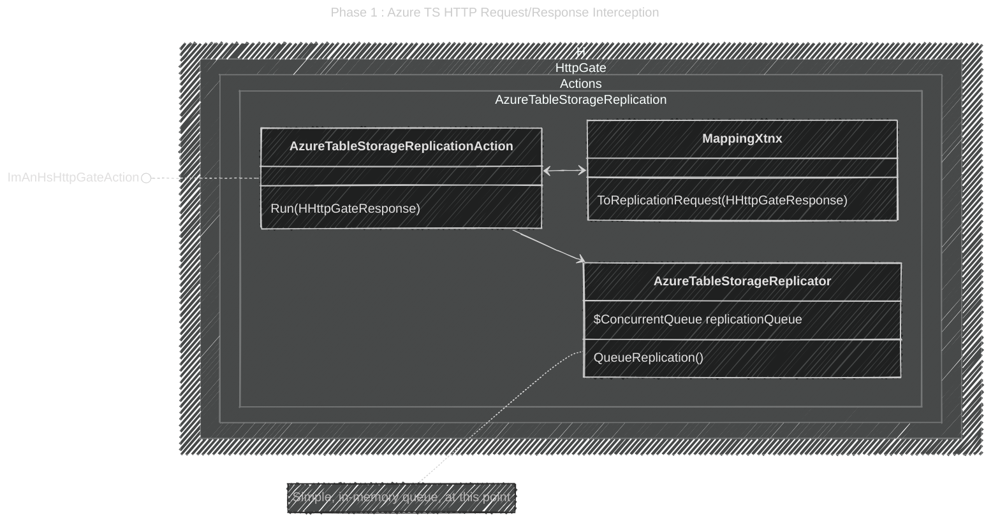
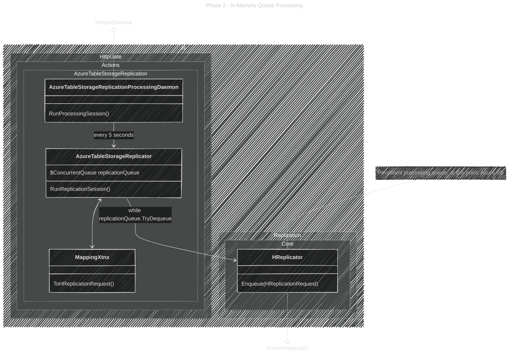
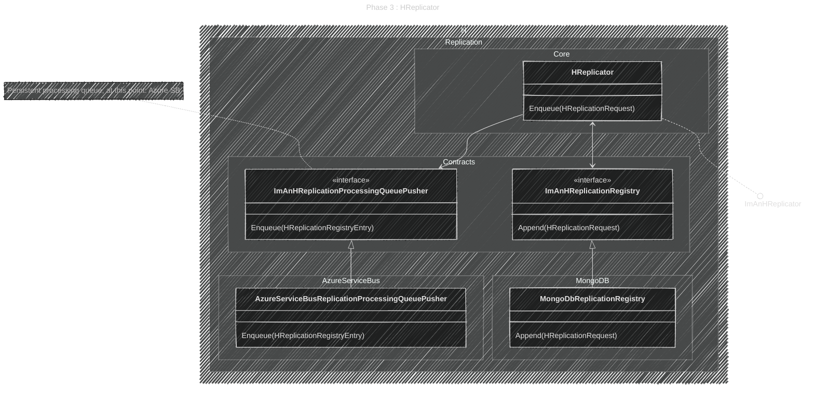
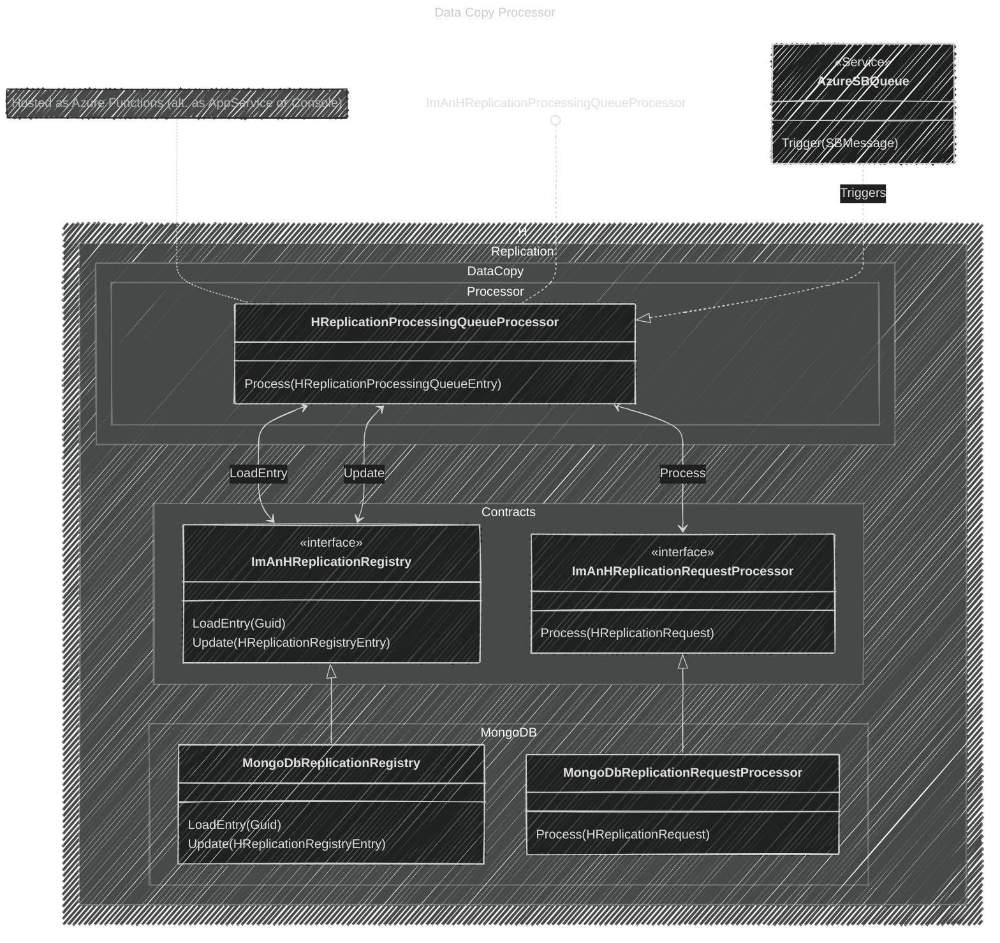

# Most Relevant Pieces

Relevant **concrete** implementations of the solution.

---

## 🛖 Runtime Hosts

### The HTTP Gate

🛖👑 **[`H.HttpGate.Runtime.Host.AspNetCore`](/Src/H.Play.HttpGate/H.HttpGate.Runtime.Host.AspNetCore)** - HTTP Gate Host

### The Data Copy Processor

🛖👑 **[`H.Replication.DataCopy.Host.AzureFunctions`](/Src/H.Play.HttpGate/H.Replication.DataCopy.Host.AzureFunctions)** - PROD Replication Host

🛖⚙️ **[`H.Replication.DataCopy.Host.AspNetCore`](/Src/H.Play.HttpGate/H.Replication.DataCopy.Host.AspNetCore)** - Alternative PROD Replication Host

🛖⚙️ **[`H.Replication.DataCopy.Host.Console`](/Src/H.Play.HttpGate/H.Replication.DataCopy.Host.Console)** - DEBUG Replication Host

> ❕📝  All 3 `H.Replication.DataCopy.Host.***` runtime hosts are very shallow and use the same logic from **[`H.Replication.DataCopy.Processor`](/Src/H.Play.HttpGate/H.Replication.DataCopy.Processor)**

---

## ✨🛠️ Concrete Pieces

### 🛖 HTTP Gate Host Layer

---

### 🛖 Data Copy Host Layer

🛖👑 **[`H.Replication.DataCopy.Host.AzureFunctions`](/Src/H.Play.HttpGate/H.Replication.DataCopy.Host.AzureFunctions)** - PROD Replication Host

🛖⚙️ **[`H.Replication.DataCopy.Host.AspNetCore`](/Src/H.Play.HttpGate/H.Replication.DataCopy.Host.AspNetCore)** - Alternative PROD Replication Host

🛖⚙️ **[`H.Replication.DataCopy.Host.Console`](/Src/H.Play.HttpGate/H.Replication.DataCopy.Host.Console)** - DEBUG Replication Host

> ❕📝  All 3 `H.Replication.DataCopy.Host.***` runtime hosts are very shallow and use the same logic from **[`H.Replication.DataCopy.Processor`](/Src/H.Play.HttpGate/H.Replication.DataCopy.Processor)**

---

## [Home ↗️](/README.md)

## Relevant Cross Module Operation and Data Contracts

These are the relevant `interfaces` and `DTOs` that are known _(globally used)_ by almost all the modules.

[Cross Module Contracts ↗️](/Docs/Arch/CrossModuleContracts.md)

## Extension Points

This part presents the extension points of the solution.

Such as:
- Run healthchecks on replications
- Rerun defunct or failed replications
- Adding a new action when TS data change occurs
- Adding a new replication destination
- Changing the underlying tech of some components 
    - E.g.: Use RabbitMQ
    - Or use another destination storage such as Cosmos, Raven, Mongo or even another TS
    - Use another storage for the replication registry
    - Implement a data mapping/transformation pipeline
    - Etc.

[Extension Points ↗️](/Docs/Arch/ExtensionPoints.md)

---