```mermaid
---
title: Azure Table Storage Data Replication Part 2
config:
  theme: dark
  look: handDrawn
---
flowchart TD
    Proxy[✨💫 ***HTTP Gate Service***]
    Daemon[🔁 Daemon as Back Service]
    InMemQueue[📨📨... ***Queue InMem***]

    Proxy -->|Hosts| Daemon

    InMemQueue --> Daemon
    Daemon -->|every 5s| InMemQueue
    
    Daemon ----> |⚙️ Run Replication Session| Replicator[💾 Data Replicator]
    Replicator -->|💾 Store Repl. Payload| Registry[📃✨ ***Replication Registry***]
    Registry --> Replicator
    Replicator --->|⚡ Queue Data Copy| Queue[📥 ***Persistent Queue***]
    Queue --> Done(✅)
```

# H's HTTP Gateway Playground play-http-gateway

A playground repo for analyzing and implementing some use cases of an HTTP Gateway.

Main focus is on data replication.

## Purpose

The purpose of this experiment is to create a replication system for services that communicate over HTTP. E.g.: Azure Storage Services (Tables, Blobs)

## Remarks for Table Storage

The hosting host name must have a subdomain with the TS AccountName. E.g.: `http://pgdanhsa.dev.localhost:5066`.

That's because the TS client works with that internally and it expects such a specific format, otherwise it crashes.

When testing locally, the TS Client cannot resolve such a host (gawd knows why, because a browser can), which means that you need to create an entry in the `hosts` file (`C:\Windows\System32\drivers\etc\hosts`) for it to work.

> 127.0.0.1       pgdanhsa.dev.localhost

## Usage

[WiP]

### Implement a gate action

1. Create an assembly/project or use an existing one
1. Make sure that it's referenced as a dependency for **H.HttpGate.Runtime.Host.AspNetCore**
1. Make sure that the given project references **H.HttpGate.Contracts.Public** and the `Microsoft.Extensions.DependencyInjection.Abstractions` NuGet
1. Create a `class` that implements `ImAnHsHttpGateAction`
1. Register the class within the service collection of the **H.HttpGate.Runtime.Host.AspNetCore** ASP.NET Host (`Program.cs` -> `builder.Services`).
1. Done, your action will now be invoked for every HTTP request and you'll have access to the Request and Response data.

---

# Architecture

Diagrams depicting how stuff works

## High Level

### 🕸️ Scalability and Resiliency _(aka Scale-Out)_

 - ***✨💫 HTTP Gate*** can safely **scale-out** _(multiple instances ✅🕸️)_.
 - ***✨💫 Replication Service*** can safely **scale-out** _(multiple instances ✅🕸️)_.
 - ***📦 Replication Registry*** **cannot scale-out** _(no multiple instances 🚫🕸️)_.
    - must be a managed storage solution, which itself can have various scalability options depending on the underlying tech _(e.g.: Raven, Mongo, SQL, TS, etc.)_.
 - ***📦 Replication Processing Queue*** **cannot scale-out** _(no multiple instances 🚫🕸️)_.
    - must be a managed solution, which itself can have various scalability options depending on the underlying tech _(e.g.: Azure QS, Azure SB, RabbitMQ, etc.)_. 

---

```mermaid
---
title: Azure Table Storage Interception
config:
  theme: dark
  look: handDrawn
---
flowchart LR
    Consumer[👤 App]
    Azure[💾 Azure Table Storage]
    Proxy[✨💫 ***HTTP Gate***]
    GateActions[✨💫 ***HTTP Gate Actions***]

    Consumer -->|Azure TS Data Request| Proxy
    Proxy -->|Forward Request| Azure
    Azure -->|Respond| Proxy
    Proxy -->|Forward Response| Consumer
    Proxy --->|✨💫 _Invoke Actions_| GateActions
```

> ⚠️ HTTP Gate **request/response pass-through** and **invoked actions** **MUST be super light** to avoid adding overhead to the App's I/O.
> 
> That means **ZERO I/O ops or other heavy operations** within the invoked actions. Queue stuff in memory and defer heavy operations.

## ✨💫 HTTP Gate Data Replication Action

```mermaid
---
title: Azure Table Storage Data Replication Part 1
config:
  theme: dark
  look: handDrawn
---
flowchart TD
    Proxy[✨💫 ***HTTP Gate Service***]
    GateAction[✨💫 ***Replication Action***]
    IsEligible{❔}

    Proxy -->|Hosts| GateAction
    GateAction -->|📨 Azure TS Req/Res| IsEligible
    IsEligible -->|❌ _Not Eligible_| DoneFast(✅)
    IsEligible --->|✅ _Is Eligible_| InMemQueue[📨📨... ***Queue InMem***]
    InMemQueue --> Done(✅)
```

---

---

